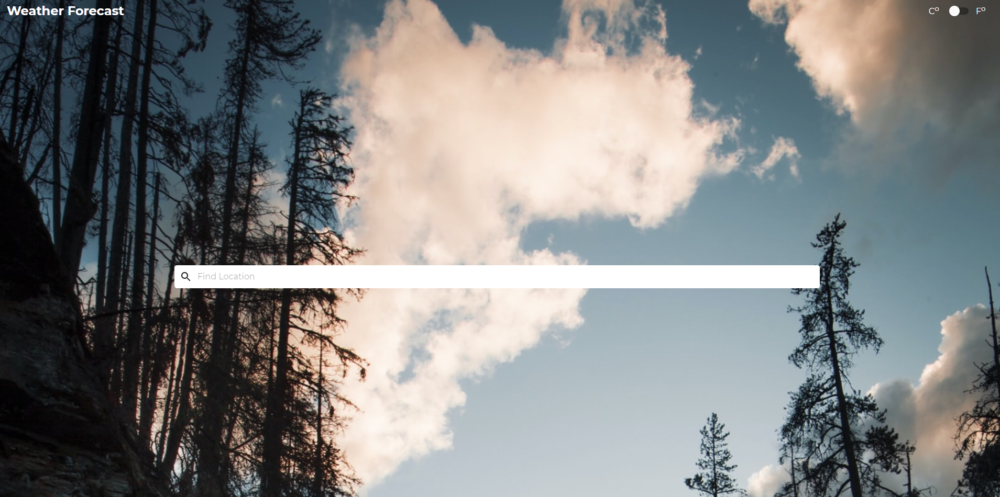
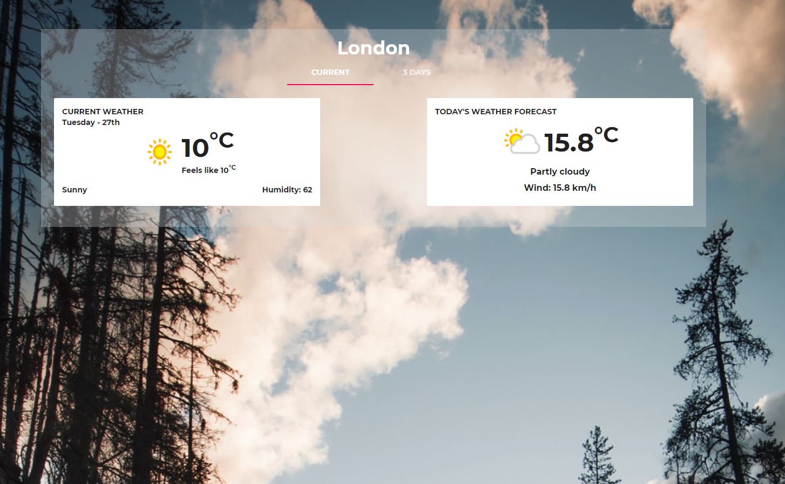
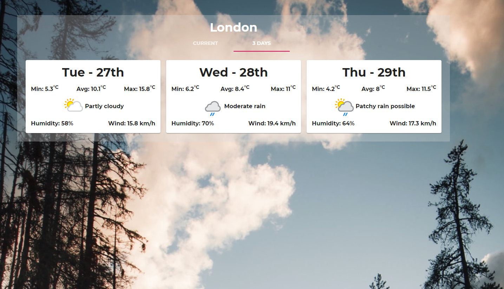
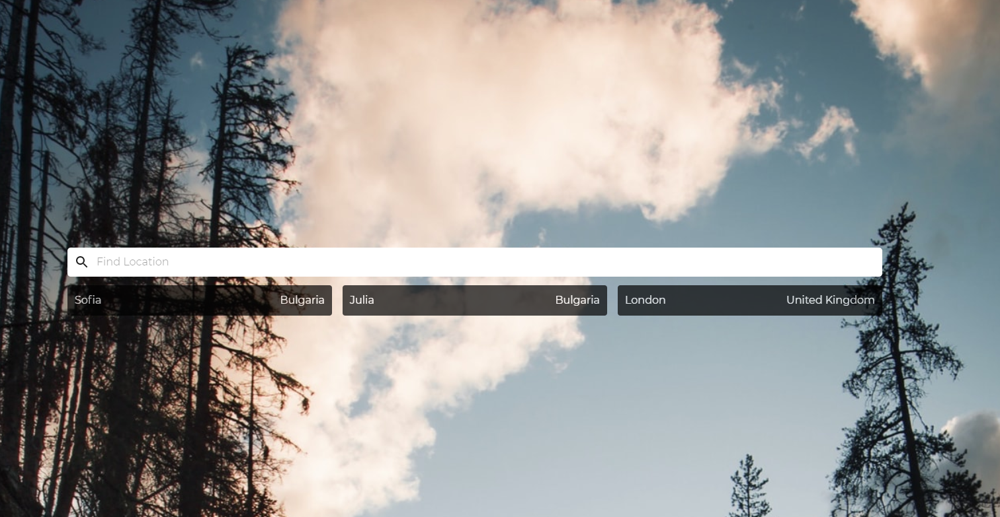

# Weather Forecast

> Website for Current and 3 days after Weather Forecast!

## Table of contents

- [Screenshots](#screenshots)
- [Technologies](#technologies)
- [Setup](#setup)
- [Features](#features)
- [Status](#status)
- [Contact](#contact)

## Screenshots

## Technologies

- React - create-react-app - version - 17.0.2
- Material-UI - version 4.11.3
- Moment - version 2.29.1
- react-router-dom - version 5.2.0
- axios - version 0.21.1

## Setup

Demo: https://weatherforecasts.netlify.app/

## Features

List of features ready and TODOs for future development

- Search with autosuggest
- Dynamic background image
- Last three visited 
- Changing degree - C or F
- Forecast for next 3 days

To-do list:

- Geolocation

## Status

Project is: _in progress_

## Contact

Created by [@Dan](https://www.linkedin.com/in/danail-kostov-ba95b81b3/) - feel free to contact me!
